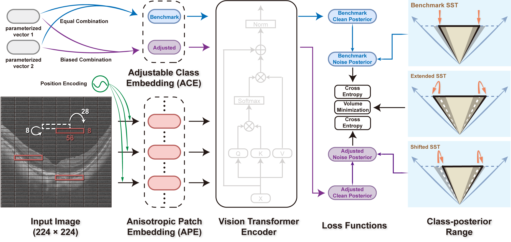

# Adjustable Robust Transformer for High Myopia Screening in Optical Coherence Tomography

Adjustable Robust Transformer (ARTran) is a method for high myopia screening. It can change the preference of the inference result according to the provided adjustment
coefficient. 




## Training
```
# An example for training on 2 GPUs:
python -m torch.distributed.launch --nproc_per_node=2 --use_env train.py --fold=1 --num-classes=2 --hw-shape=224,224 --kernel-size=56,8 --stride=28,8 --dataroot='' --output-dir=''
```


## Inferencing
```
# An example for inferencing:
python test.py --fold=1 --num-classes=2 --hw-shape=(224, 224) --kernel-size=(56, 8) --stride=(28, 8) --dataroot='' --resume=''
```


## Citing
- TO DO
